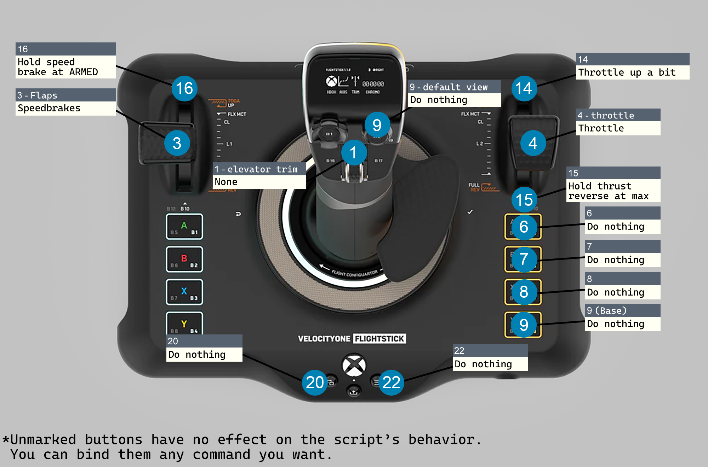

[Download Link](https://github.com/chrimp/Flightstick_extension/releases)

[한국어](#한국어)  
[English](#English)

# 한국어

Toliss A320 Family와 터틀비치 벨로시티원 플라이트스틱용 Lua 스크립트 입니다.

## 기능
- 스포일러 ARM
- FLX/MCT Detent
- TO/GA Detent
- 트림 휠을 통한 FCU (속도, 방위, 고도, 상승/하강률), 엘레베이터 트림 제어
- FCU 노브 누르기/당기기
- 가운데 휠 조작시 양 옆 버튼 비활성화 (오조작 방지)

[기능 소개/설치 가이드](https://youtu.be/ooHXa0mzt3g)  
(2024-03-13 추가)  
Base의 6, 7, 8, 9 버튼은 각각 속도, 헤딩, 고도, VS 조작을 활성화합니다.  
Top의 9번 버튼은 엘레베이터 트림 조작을 활성화합니다.

## 설치 방법

### FlyWithLua 설치
[FlyWithLua NG+ 배포 웹페이지](https://forums.x-plane.org/index.php?/files/file/82888-flywithlua-ng-next-generation-plus-edition-for-x-plane-12-win-lin-mac/)  
- 압축파일 안에 있는 'FlyWithLua' 폴더를 X-Plane 12\Resources\plugins\ 폴더 안에 복사합니다.
- FlyWithLua\Scripts 폴더 안에 'please read the manual.lua' 파일을 삭제합니다.

### 스크립트 설치/조이스틱 설정
모든 설정은 조이스틱이 **왼손 모드**로 설정된 기준입니다.

[스크립트 다운로드](https://github.com/chrimp/Flightstick_extension/releases/download/23-07-11/TolissFS.lua)
- 'TolissFS.lua' 파일을 FlyWithLua\Scripts 폴더 안에 복사합니다.
- (방법 1) X-Plane을 실행하고, 설정 -> Joystick에서 아래의 사진대로 버튼을 설정합니다.

- (방법 2) [설정파일 다운로드](https://github.com/chrimp/Flightstick_extension/releases/download/23-07-11/X-Plane.Joystick.Settings.zip) 압축 파일을 다운로드 합니다.
- 압축 파일 내부의 'X-Plane Joystick Settings.prf' 파일을 X-Plane 12\Output\preferences 폴더 안에 복사합니다.

(방법 2 사용시 기존 조이스틱 설정이 사라지므로 주의해주세요.)

# English

This is a Lua script for Toliss A320 Family on Turtle Beach VelocityOne Flightstick.

## Features
- Spoilers ARM
- FLX/MCT Detent
- TO/GA Detent
- FCU (Speed, Heading, Altitude, Vertical Speed), elevator trim control with trim wheel
- FCU knob push/pull
- Disables two buttons next to the center wheel when rotating the wheel (preventing unintentional trigger)

[Feature Overview/Installation Guide (Subtitles available)](https://youtu.be/ooHXa0mzt3g)  
(Added March 13, 2024)  
Button 6, 7, 8, and 9 on the Base enables Speed, Heading, Altitude, V/S control each.  
Button 9 on the Top enables Elevator Trim control.

## Installation
### FlyWithLua Installation
[FlyWithLua NG+ Official Thread](https://forums.x-plane.org/index.php?/files/file/82888-flywithlua-ng-next-generation-plus-edition-for-x-plane-12-win-lin-mac/)
- Copy 'FlyWithLua' folder in the zip file to X-Plane 12\Resources\plugins\ folder.
- Delete 'please read the manual.lua' file in FlyWithLua\Scripts folder.
### Script Installation/Joystick Configuration
All mappings are based on the **Left Orientation** mode.

[Script Download](https://github.com/chrimp/Flightstick_extension/releases/download/23-07-11/TolissFS.lua)
- Copy 'TolissFS.lua' file to FlyWithLua\Scripts folder.
- (Method 1) Run X-Plane and configure buttons as shown in below image in Settings -> Joystick.

- (Method 2) [Download configuration file](https://github.com/chrimp/Flightstick_extension/releases/download/23-07-11/X-Plane.Joystick.Settings.zip) Download the zip file.
- Copy 'X-Plane Joystick Settings.prf' file in the zip file to X-Plane 12\Output\preferences folder.

(If you use Method 2, your existing joystick configuration will be overwritten.)
